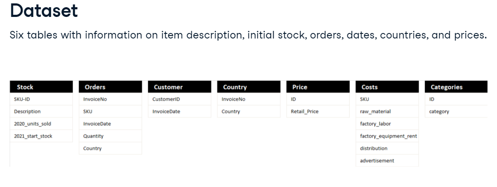
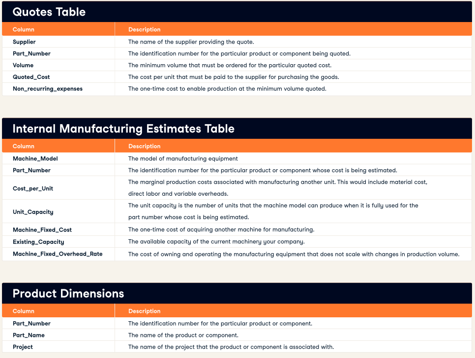
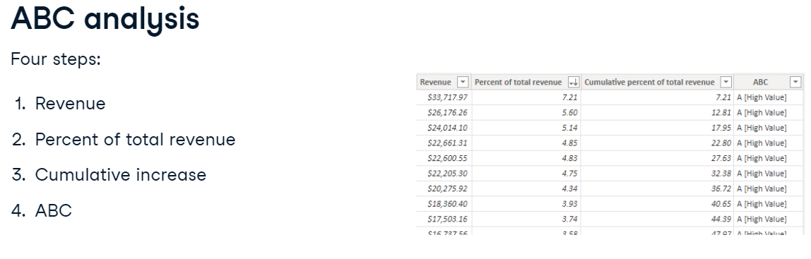

  
  ```{r setup, include=FALSE}
knitr::opts_chunk$set(echo = TRUE)
```


# Data Management Exercise {.tabset}

## Welcome 

This week we are doing exercise, and focus of exercise will be on the three software done during the training.

1. MS Excel
2. R
3. PowerBi

### Data can be fun | Visualization and story telling
```{r echo=FALSE, warning=TRUE}
knitr::include_url("https://www.gapminder.org/tools/#$chart-type=bubbles&url=v1")

```


### 1. MS Excel

  General use and understanding of Microsoft excel. Maneouvering through workbooks, sheets and formulas.

  Intertwined understanding of how formulas work with sheets across workbooks.

### 2. R Software

  Statistical software used for analysis.

  Work around understanding of what R Software is and familirazation to the IDE RStudio


### 3. PowerBI

  Software tool used for visualization and story telling.

  Creation of dashboards that are fed directly from raw data format.

  Introduction of the interface, use of visuals and how to change functions.

  Understanding of how to manipulate data on the data structure end.


### Overview of our knowledge

* Installation of MS Excel
* Installation of R
* Installation of RStudio
* Installation of PowerBI
* Interface familiarization


### Teaching guide

* Mixed instructional guide, with the presentation but focused on getting more hard skills
* Engagements and practice on the fly

### Datasets

Link to all the datasets we will be using [here](https://github.com/Qprop/DataManagementExercises/tree/master/Data) . Will be accessing my github account for the data

## Day 1 {.tabset}

### English Premier League Data

We will be using excel for this exercises, we have data from 2009 to 2019 of the english premier league

You can find the dataset in the **Data>English Premier League_09_19** folder [source of data](https://datahub.io/sports-data/english-premier-league#resource-english-premier-league_zip). Or follow the link [PremierLeague](https://github.com/Qprop/DataManagementExercises/tree/master/Data/English%20Premier%20League_09_19) 

#### Task

1. Merge all the datasets into 1 workbook with one sheet having data from 2009 to 2019, named "merged sheet"
2. Ensure the data structure columns align
3. Below analysis
  - How many games did each team play away and home for the 10 seasons
  - How many referees have been there for the 10 Seasons
  - Who officiated the highest number of games as a referee
  - What is the total games won in the 10 season for the teams and how many lost games for the 10 seasons
  - Which team has the highest goals under the three categories total goals, home games and away games


**Hint**

- FTHG (Final Time Home Game)
- FTAG (Final Time Away Game)
- FTR (Final Time Rate: A (Away won), H (Home Won))


### Collage Majors Dataset

Dataset is about college majors across different universities and major/course they undertook. 
This can be found under the **Data>College Majors** folders. Or follow the link [MajorCollege](https://github.com/Qprop/DataManagementExercises/tree/master/Data/College%20Majors) 

#### Task

1. Give resulst of the general statistics of the below information
  - How many schools in the dataset
  - Number of years the dataset spans across
  - Gender of students across different Schools across the different years
  - Top 10 majors
  - Average tuition per major per school
  - Average debt per major per school
  
2. Unemployment index based of number of student graduates .i.e. % of students who are unemployed
  - crosstab by School
  - Crosstab by Year
  - Crosstab by Gender
  - Crosstab with all the three
  
3. Do a regression analysis of whether tution fee, debt and graduate numbers impact unemployment.
  - Experiment using other variables/columns
  
4. Write down simple summary of the information.


### Video Game Dataset

Dataset contains video games sold across the world for a number of years.

This can be found under the **Data>Video Games** folders. Or follow the link [VideoGame](https://github.com/Qprop/DataManagementExercises/tree/master/Data/Video%20Games)

#### Tasks

1. Give resulst of the general statistics of the below information
  - How many platforms in the dataset
  - Year with the highest number of games
  - Which is the highest game in global sales
  - Which region accounts for the highest number of sales year on year
  
2. Which genre of games has the highest sales overall, what is the year trend of sales for each genre

3. Which publisher has the highest number of games


## Day 2 {.tabset .tabset-pills}

Rstudio installation quiz set 
Link to quiz [here](https://qprop.shinyapps.io/instructor_exam/) or see below

We are going to use the day's before datasets but instead of using Excel, we will now use R.


### English Premier League Data

We will be using R for this exercises, we have data from 2009 to 2019 of the english premier league

You can find the dataset in the **Data>English Premier League_09_19** folder [source of data](https://datahub.io/sports-data/english-premier-league#resource-english-premier-league_zip). Or follow the link [PremierLeague](https://github.com/Qprop/DataManagementExercises/tree/master/Data/English%20Premier%20League_09_19) 

#### Task

1. Merge all the datasets into 1 workbook with one sheet having data from 2009 to 2019, named "merged sheet"
2. Ensure the data structure columns align
3. Below analysis
  - How many games did each team play away and home for the 10 seasons
  - How many referees have been there for the 10 Seasons
  - Who officiated the highest number of games as a referee
  - What is the total games won in the 10 season for the teams and how many lost games for the 10 seasons
  - Which team has the highest goals under the three categories total goals, home games and away games


**Hint**

- FTHG (Final Time Home Game)
- FTAG (Final Time Away Game)
- FTR (Final Time Rate: A (Away won), H (Home Won))


### Collage Majors Dataset

Dataset is about college majors across different universities and major/course they undertook. 
This can be found under the **Data>College Majors** folders. Or follow the link [MajorCollege](https://github.com/Qprop/DataManagementExercises/tree/master/Data/College%20Majors) 

#### Task

1. Give resulst of the general statistics of the below information
  - How many schools in the dataset
  - Number of years the dataset spans across
  - Gender of students across different Schools across the different years
  - Top 10 majors
  - Average tuition per major per school
  - Average debt per major per school
  
2. Unemployment index based of number of student graduates .i.e. % of students who are unemployed
  - crosstab by School
  - Crosstab by Year
  - Crosstab by Gender
  - Crosstab with all the three
  
3. Do a regression analysis of whether tution fee, debt and graduate numbers impact unemployment.
  - Experiment using other variables/columns
  
4. Write down simple summary of the information.


### Video Game Dataset

Dataset contains video games sold across the world for a number of years.

This can be found under the **Data>Video Games** folders. Or follow the link [VideoGame](https://github.com/Qprop/DataManagementExercises/tree/master/Data/Video%20Games)

#### Tasks

1. Give resulst of the general statistics of the below information
  - How many platforms in the dataset
  - Year with the highest number of games
  - Which is the highest game in global sales
  - Which region accounts for the highest number of sales year on year
  
2. Which genre of games has the highest sales overall, what is the year trend of sales for each genre

3. Which publisher has the highest number of games
   


## Day 3 {.tabset .tabset-pills}

Using Inventory data to create a dashboard of our own choice look and feel.

Datasets **Data>inventory_powerbi** two files:

1. categories.csv
2. warm_data.xlsx

### Task 1

1. Prepare clean and explore the dataset to see what it contains using a mix of excel and power query

2. What does the categories data contain

3. What does the warm_data contain

### Task 2

Some of the analysis to be done and not limited to this only, you can pick what is flexible for your case

1. Revenue `Revenue = Quantity of units sold * selling price`
2. Cost of Goods Sold (COGS) `production costs of the goods`
3. Profit `Profit = COGS - Revenue`

Data structure




Data Table Defintion



Ensure that data is clean and free from duplicates.


### Task 3

Inventory Control and Management

1. Average Inventory Value `(starting value + Ending value)/2`

2. Inventory Turnover `COGS/ Average Inventory Value`

3. *ABC Analysis  (Optional and needs to be researched) 


Create a new page named "Sales by Year" and visualize;
  - The total quantity of orders by year.
  - The descending rank with the percentages of the top sold products for the the top selling year only


**HINT** All sample results done in the solutions folder


## Day 4 {.tabset .tabset-pills}

Continuation of PowerBI exercises and solutions.


Using the English Premier League data create your own dashboard in any way you would want it to look like.


## Day 5 {.tabset .tabset-pills}


Wrapping up and consolidating what we have learnt and the exercise we have done thus far.

We have noticed the interchange and use of excel, R and Power BI.
Each has its own advantage over the other as well as disadvantages.


*It is all a matter of exercising and practicing, creating your mental memory*

**Finally Q & A**